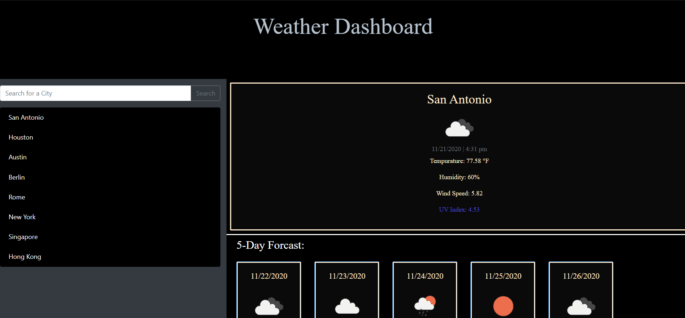

# Weather_Dashboard
Here is a simple weather dashboard. It utilizes an api from open weather to populate the data of the city the user inputs. The user input will be saved to a list under searchbar for quick access again. The city the user types in will query the api for the desired data and brings it up. Here are some of the weather info you can get temperature, humidity, wind speed and UV index. The UV index will change color depending on the value of it. Blue for good, orange for moderate, and red for severe.

Here's a screenshot of the application:
